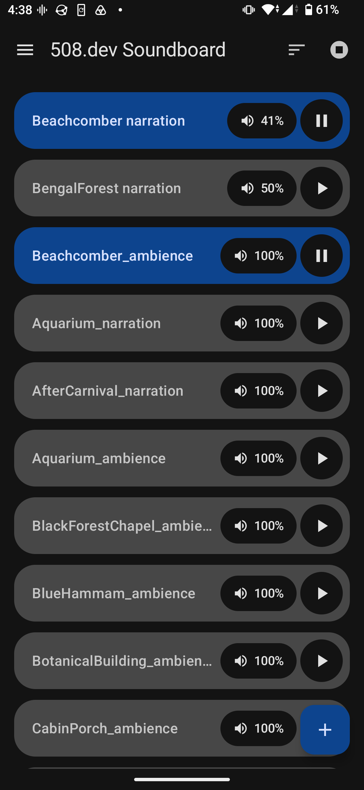

# Soundboard



An offline Android app for mixing looping sounds. Pick audio files from your
device, play any number of them at the same time, and set each one's volume
independently — rain under a fan under a café, at whatever balance you like.

Free software (GPL-3), no account, no network calls, no telemetry.

## What It Does

- **Add sounds** with the `+` button. The system file picker opens and accepts a
  multi-selection, so a whole folder of ambience lands in one go. The files
  themselves are never copied or moved — Soundboard just remembers where they
  are.
- **Play any combination at once.** Each row has its own play/pause toggle, and
  sounds loop until you stop them. Tapping anywhere on a row toggles it too.
- **Set each sound's volume** by tapping its volume pill, then dragging around
  the dial. The percentage is _relative_: your device's volume keys still move
  the whole mix together, and each sound keeps its balance within it.
- **Keeps playing in the background** with the screen off. A notification shows
  how many sounds are running and offers "Stop all".
- **Remove a sound** by long-pressing its row and choosing Delete. This only
  takes it off the board — your audio file is left exactly where it is.

## Install

| Where                                                             | Notes                                                                                                                                  |
| ----------------------------------------------------------------- | -------------------------------------------------------------------------------------------------------------------------------------- |
| [GitHub Releases](https://github.com/508-dev/soundboard/releases) | Signed APK plus its SHA-256, for side-loading.                                                                                         |
| F-Droid, our repository                                           | Add `https://508-dev.github.io/soundboard/fdroid/repo` in F-Droid → Settings → Repositories. Same signature as the GitHub Release APK. |
| Google Play                                                       | Coming once the listing is live.                                                                                                       |
| f-droid.org                                                       | Coming once the submission is accepted. Built and signed by F-Droid, so it cannot be updated over a build from the channels above.     |

## Requirements

- Android 8.0 (API 26) or newer.
- Audio files already on your device or reachable through a document provider.

## Quickstart

```bash
git clone <this repo>
cd soundboard
./gradlew installDebug     # with a device connected or an emulator running
```

Or open the repo root in Android Studio and hit Run. First-time setup and the
JDK note for CLI builds are in [`docs/development.md`](docs/development.md).

## Tooling

Kotlin + Jetpack Compose, single Gradle module, no backend.

| Component                       | Version      |
| ------------------------------- | ------------ |
| Android Gradle Plugin           | 9.2.0        |
| Gradle                          | 9.4.1        |
| Kotlin                          | 2.3.20       |
| Compose BOM                     | 2026.08.00   |
| Media3 (ExoPlayer)              | 1.11.0       |
| DataStore                       | 1.2.1        |
| minSdk / targetSdk / compileSdk | 26 / 36 / 37 |

Full table and pinning policy: [`docs/tooling.md`](docs/tooling.md).

## Checks

```bash
./gradlew check            # ktlint + unit tests + Android lint
./gradlew assembleDebug    # ...and package the APK
```

Unit tests cover the pure logic — board mutations, persistence and its
corruption handling, and the volume dial's angle→percent mapping. Playback,
mixing, audio focus, and the foreground service need a real device; the manual
pass is written up in
[`docs/development.md`](docs/development.md#testing-audio-behavior).

## How It Works

Four small layers:

- **`data/`** — the board is one JSON document (DataStore). `SoundLibrary` holds
  every mutation as a pure function, so the list logic tests without an Android
  runtime. `SoundRepository` also owns the Storage Access Framework read grants.
- **`audio/`** — `SoundboardEngine` runs one ExoPlayer per sound, which is what
  makes simultaneous, independently-mixed, gaplessly-looping playback work.
  Audio focus is requested once for the whole app rather than per player.
  `PlaybackService` is a foreground service that exists only to keep the process
  alive and show the notification.
- **`ui/`** — a navigation drawer over three destinations (the board, About,
  Licenses), a Compose list of cards, and the custom `Canvas` volume dial.
- **`SoundboardApp`** — the composition root. No DI framework.

The reasoning behind each of those, and the options that were rejected, is in
[`DECISIONS.md`](DECISIONS.md). Read it before changing anything under `audio/`
— the threading and audio-focus rules are easy to break with a change that
compiles cleanly.

## Repository Layout

| Path             | What                                                               |
| ---------------- | ------------------------------------------------------------------ |
| `app/`           | The single Gradle module; all app code.                            |
| `docs/`          | Development, tooling, deployment, security, supply-chain docs.     |
| `scripts/`       | Thin `./gradlew` wrappers, plus the two release scripts.           |
| `fastlane/`      | Store listing copy and release notes, shared by Play and F-Droid.  |
| `fdroid/`        | Config for our F-Droid repository, and the f-droid.org submission. |
| `extras/github/` | Opt-in GitHub hygiene (CODEOWNERS, gitleaks, dependency review).   |
| `SPEC.md`        | The MVP product spec.                                              |
| `DECISIONS.md`   | Architecture decisions and their reasoning.                        |
| `AGENTS.md`      | Operating instructions for AI agents working in this repo.         |
| `MANIFEST.md`    | Inventory of the 508.dev devkit this repo was generated from.      |

## Privacy

Everything stays on your device. The app requests no `INTERNET` permission, so
it cannot phone home even by accident. It never asks for broad storage access
either — only per-file read permission for the sounds you explicitly pick.

See [`SECURITY.md`](SECURITY.md) for the full data-handling note and how to
report a vulnerability.

## Releases

Versioning and publishing are automated. Merging a PR to `main` updates a
standing release PR; merging _that_ tags a version and publishes the signed APK
to GitHub Releases and our F-Droid repository, and the AAB to Play's internal
track. Commit subjects are
[Conventional Commits](https://www.conventionalcommits.org/) and decide the
version.

Full pipeline, versioning rules, signing, and one-time setup:
[`docs/deployment.md`](docs/deployment.md).

## License

GPL-3.0. See [`LICENSE`](LICENSE).
